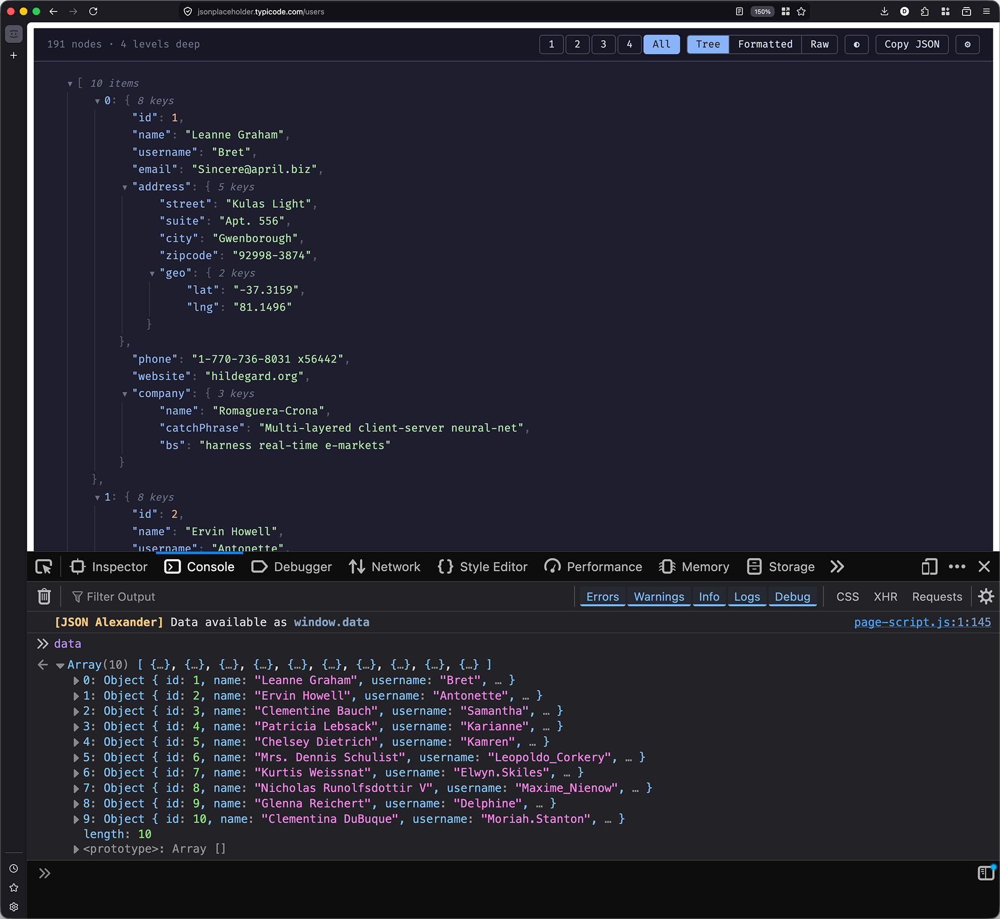

# JSON Alexander


Believe it or not, George formats JSON.

[](https://chromewebstore.google.com/detail/json-alexander/aegihabihhhoihnomlekgheekcdcifpk)
[](https://chromewebstore.google.com/detail/json-alexander/aegihabihhhoihnomlekgheekcdcifpk)
[](https://chromewebstore.google.com/detail/json-alexander/aegihabihhhoihnomlekgheekcdcifpk)




## Features

- Syntax highlighting for keys, strings, numbers, booleans, and null
- Collapsible/expandable tree view with level controls
- Hover any property to see its full JSON path — click to pin, then copy
- Expand/collapse all children of an object with inline button
- Three view modes: Tree, Formatted, and Raw
- Copy JSON to clipboard
- JSON payload available in the console as `window.data`
- Light, dark, and auto (system) themes
- Indent guide lines with hover highlighting
- Optional custom cursor (via settings)

## Installation

### Chrome

1. Open Chrome and navigate to `chrome://extensions`
2. Enable **Developer mode** (toggle in the top right)
3. Click **Load unpacked**
4. Select the **`dist`** folder inside this project

### Firefox

1. Open Firefox and navigate to `about:debugging#/runtime/this-firefox`
2. Click **Load Temporary Add-on...**
3. Select the `manifest.json` file inside **`dist`**

#### Disable Firefox's Native JSON Viewer

Firefox has a built-in JSON viewer that can prevent this add-on from taking over JSON pages. Disable it first:

1. Open a new tab and go to `about:config`
2. Accept the warning prompt if shown
3. Search for `devtools.jsonview.enabled`
4. Set it to `false`
5. Reload any JSON page

## Development

```bash
npm run dev    # watch mode — rebuilds on file changes
npm run build  # production build
npm run zip    # build and create json-alexander.zip
```

After making changes, reload the extension in your browser.

## Usage

Navigate to any URL that returns JSON (e.g. `https://jsonplaceholder.typicode.com/users`). The extension automatically detects JSON responses and replaces the page with an interactive viewer.

- **Level buttons** (1, 2, 3... All) — collapse/expand the tree to a specific depth
- **View picker** (Tree / Formatted / Raw) — switch between interactive tree, pretty-printed JSON, and raw JSON
- **Theme toggle** — cycle between auto, dark, and light
- **Copy JSON** — copy the full JSON to clipboard
- **Click any line** — pins the JSON path in the toolbar, click Copy to copy it
- **Console** — the parsed JSON is available as `window.data`
- **Settings** (⚙) — toggle custom cursor
